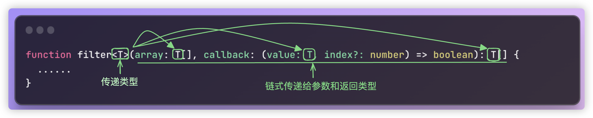

## 理解泛型

前面讲解了这么多，突然有一天有一个很简单的需求摆在你的面前，让你用Typescript封装一个函数，传入任意类型的参数，传入什么类型就返回什么类型......

对于Javascript来说，这有什么难度？甚至用箭头函数写更加简单

```javascript
function identity(value){
  return value;
}
const identity = value => value;
```

但是对于Typescript来说，就有问题了，参数要有约束，返回的类型也应该和参数是同一个类型，那这该怎么办？

难道传入`number`？传入`string`？

```typescript
function identity(value:number){
  return value;
}
```

但是这样不是限定死了，就只能是参数限定的类型吗？

既然要任何类型，首先你会想到用`any`

```typescript
function identity(value:any){
  return value;
}

const s = identity("hello");
```

但是用了`any`和直接写Javascript有什么区别呢？这就丧失了类型检查的效果。就算现在不报错了，**最后得到的变量其实也不知道到底是什么类型**，比如上面代码中的变量，并没有调用字符串的相关方法的提示。这就完全丧失了使用Typescript的意义。

当然这个时候，我们就会想到前面刚刚讲的**函数重载**

```typescript
function identity(value: number):number;
function identity(value: string):string;
function identity(value: boolean):boolean;
function identity(value: number | string | boolean): number | string | boolean { 
  return value;
}

const s = identity("aaa");
```

这么写貌似没问题了，但是仅仅就只有3个基本类型啊，如果还有不同类型的数组呢？不同类型的数组都还好说，无非就继续往上加类型而已

```typescript
function identity(value: number):number;
function identity(value: string):string;
function identity(value: boolean): boolean;
function identity(value: number[]): number[];
function identity(value: string[]):string[];
function identity(value: number | string | boolean | number[] | string[]): number | string | boolean | number[] | string[]{ 
  return value;
}

const s1 = identity([1,2,3,4]);
const s2 = identity(["a","b","c","d"]);
```

但是如果还有对象类型呢？

```diff
function identity(value: number):number;
function identity(value: string):string;
function identity(value: boolean): boolean;
function identity(value: number[]): number[];
function identity(value: string[]): string[];
+function identity(value: object): object;
+function identity(value: number | string | boolean | number[] | string[] | object): number | string | boolean | number[] | string[] | object{ 
+  return value;
+}

const s1 = identity([1,2,3,4]);
const s2 = identity(["a","b","c","d"]);
+const s3 = identity({ id: 1, name: "aaa" });
+console.log(s3.name) // error 类型“object”上不存在属性“name”
```

对象类型object会报错，为什么？这在我们之前就解释过，object仅仅表示对象而已，并不知道对象里面具体有什么，那我们就只能使用对象字面量...那这就完全没戏了。谁知道对象字面量里面有多少的内容呢?

那么这里好像就没有更好的办法可以解决了？

如果能利用Typescript的自动推导的功能，**我不确定当前用什么类型，当用到什么类型的参数的时候，根据我传给你的类型进行推导，只要在我代码用到了推导的类型，那么就都是这个类型**，这就是我们要讲的泛型

```typescript
function identity<T>(value: T): T{ 
  return value;
}
```

在函数名后，使用尖括号`<>`来声明泛型`T`，表示传递的泛型的类型，你可以把他先理解为一种占位符号。后面凡是出现一样的这个符号`T`，那就表示是一样的类型。

本质上`T`其实和我们写的number，string等等是一个意思。当我们调用时：

```typescript
function identity<T>(value: T): T{ 
  return value;
}

type User = {
  id: number,
  name: string
}

const s1 = identity<number>(1)
const s2 = identity<string>("a")
const s3 = identity<User>({id:1,name:"aaa"})
console.log(s3.name) // ok
```

当我们调用的时候，TS其实可以根据我们传入的参数自动推导泛型的类型，所以，调用的时候，前面的`<>`是可以省略的。

```typescript
const s1 = identity(1)
const s2 = identity("a")
const s3 = identity({id:1,name:"aaa"})
console.log(s3.name) // ok
```

那为什么是`T`？

> `T`就是一个类型名称，如果愿意，可以使用任意的其他字母名称，例如，A，B，C等等。
>
> 按照惯例，经常使用单个大写字母，从`T`开始，依次使用`U`，`V`，`W`等。
>
> 就算是多个单词`Abb`，`Acc`也没有问题，因为**泛型字母就表示一个占位符，类型检查器将根据上下文填充具体的类型**。
>
> 不过一般`T`，`E`，`K`，`V`，`U`等字母用的比较多而已

再来一个例子：

```typescript
function getTuple<T>(a: T, b: T){ 
  return [a, b]
}
const as = getTuple<string>("hello", "world");
```

我们之前还写过这样的代码：

```typescript
function myNumberFilter(arr:number[],callback:(item:number, index?:number) => boolean):number[] { 
  const result = [];
  for (let i = 0; i < arr.length; i++) {
    const item = arr[i];
    if (callback(item)) {
      result.push(item);
    }
  }
  return result;
}
const filterArr1 = myNumberFilter([1, 2, 3, 4, 5], item => item % 2 === 0);
console.log(filterArr1);

function filter<T>(arr:T[], callback:(item: T,index?:number) => boolean):T[] { 
  const result = [];
  for (let i = 0; i < arr.length; i++) {
    const item = arr[i];
    if (callback(item)) {
      result.push(item);
    }
  }
  return result;
}

const filterArr2 = filter(["xxx.js","aaa.java","bbb.md"], item => item.endsWith(".js"));
console.log(filterArr2);
```

编译之后，你会发现`myNumberFilter`，`filter`这两个函数的内部逻辑是一模一样的。

这其实更进一步验证了我们之前一直讲的，类型系统和逻辑是分离的，我们在编译时把类型修改成什么样，并不会对运行时的逻辑产生任何影响。

但是，泛型让函数的功能，在编译时更具有一般性，比接受具体类型的函数更加强大。

**泛型可以理解为一种约束。**

当我们把函数的参数注解为`fn(n:number)`的时候，参数`n`的值就被约束为了`number`类型。

同样，泛型`T`把`T`所在位置的类型约束为`T`所绑定的类型



当然，上面的函数是函数声明的写法，函数表达式写法也一样：

```typescript
const filter = <T>(array: T[], callback: (value: T, index?: number) => boolean): T[] => { 
	......
}
```

由于泛型本身十分的方便好用，所以在数组，对象，类型别名，以及后面要讲解的类和接口中都可以使用泛型。

只要有可能就应该使用泛型，这样写出来的代码更具有一般性，可以重复使用，并且简明扼要